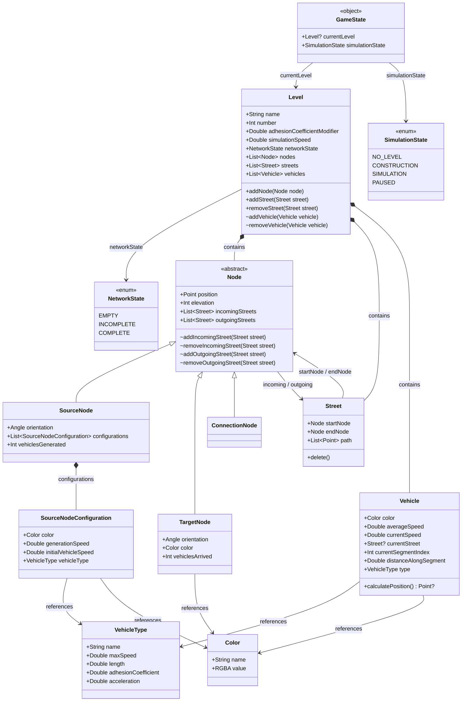

# Domain Model Class Diagram

```mermaid
classDiagram
    class GameState {
        <<object>>
        +Level? currentLevel
        +SimulationState simulationState
    }
    
    class SimulationState {
        <<enum>>
        NO_LEVEL
        CONSTRUCTION
        SIMULATION
        PAUSED
    }
    
    class NetworkState {
        <<enum>>
        EMPTY
        INCOMPLETE
        COMPLETE
    }
    
    class Level {
        +String name
        +Int number
        +Double adhesionCoefficientModifier
        +Double simulationSpeed
        +NetworkState networkState
        +List~Node~ nodes
        +List~Street~ streets
        +List~Vehicle~ vehicles
        +addNode(Node node)
        +addStreet(Street street)
        +removeStreet(Street street)
        ~addVehicle(Vehicle vehicle)
        ~removeVehicle(Vehicle vehicle)
    }
    
    class Node {
        <<abstract>>
        +Point position
        +Int elevation
        +List~Street~ incomingStreets
        +List~Street~ outgoingStreets
        ~addIncomingStreet(Street street)
        ~removeIncomingStreet(Street street)
        ~addOutgoingStreet(Street street)
        ~removeOutgoingStreet(Street street)
    }
    
    class SourceNode {
        +Angle orientation
        +List~SourceNodeConfiguration~ configurations
        +Int vehiclesGenerated
    }
    
    class TargetNode {
        +Angle orientation
        +Color color
        +Int vehiclesArrived
    }
    
    class ConnectionNode {
    }
    
    class Street {
        +Node startNode
        +Node endNode
        +List~Point~ path
        +delete()
    }
    
    class SourceNodeConfiguration {
        +Color color
        +Double generationSpeed
        +Double initialVehicleSpeed
        +VehicleType vehicleType
    }
    
    class Vehicle {
        +Color color
        +Double averageSpeed
        +Double currentSpeed
        +Street? currentStreet
        +Int currentSegmentIndex
        +Double distanceAlongSegment
        +VehicleType type
        +calculatePosition() Point?
    }
    
    class VehicleType {
        +String name
        +Double maxSpeed
        +Double length
        +Double adhesionCoefficient
        +Double acceleration
    }
    
    class Color {
        +String name
        +RGBA value
    }

    GameState --> Level : currentLevel
    GameState --> SimulationState : simulationState
    Level --> NetworkState : networkState
    Level *-- Node : contains
    Level *-- Street : contains
    Level *-- Vehicle : contains
    
    Node <|-- SourceNode
    Node <|-- TargetNode
    Node <|-- ConnectionNode
    
    Street --> Node : startNode / endNode
    Node --> Street : incoming / outgoing
    
    SourceNode *-- SourceNodeConfiguration : configurations
    SourceNodeConfiguration --> VehicleType : references
    SourceNodeConfiguration --> Color : references
    
    TargetNode --> Color : references
    
    Vehicle --> VehicleType : references
    Vehicle --> Color : references
```
